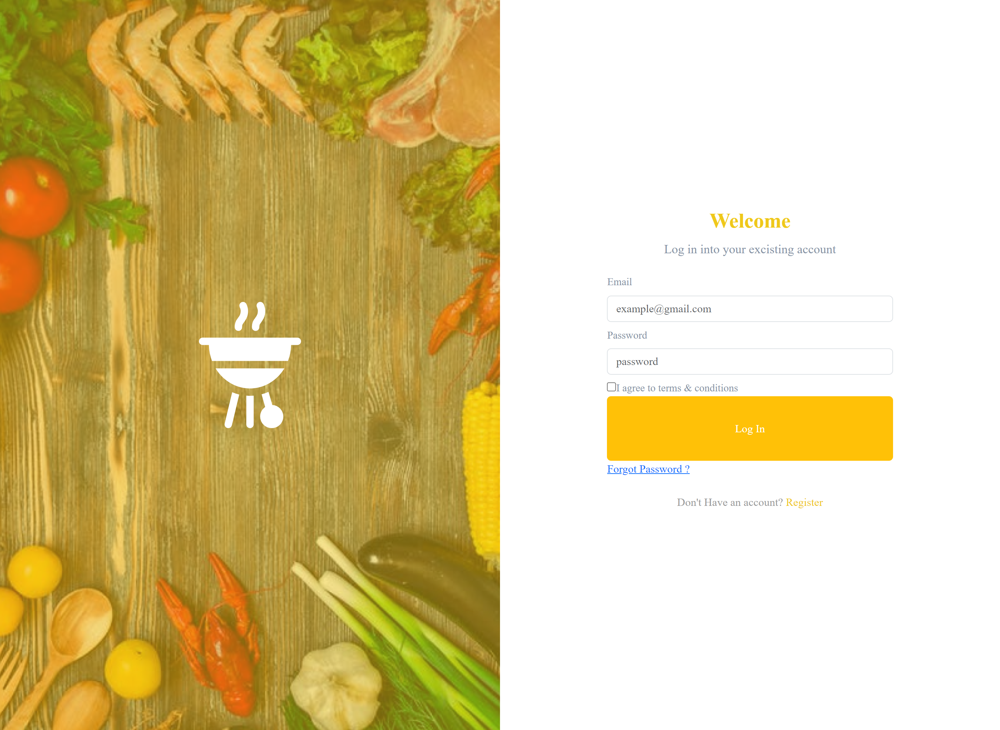
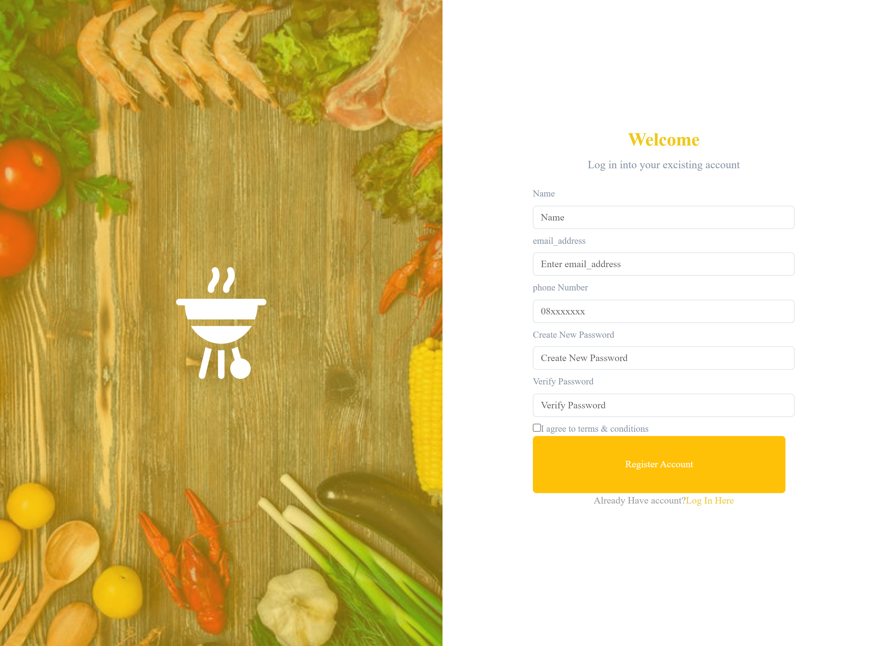
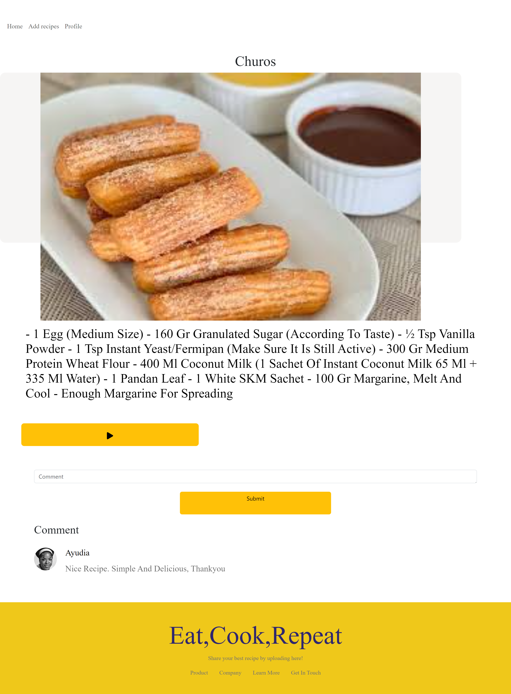
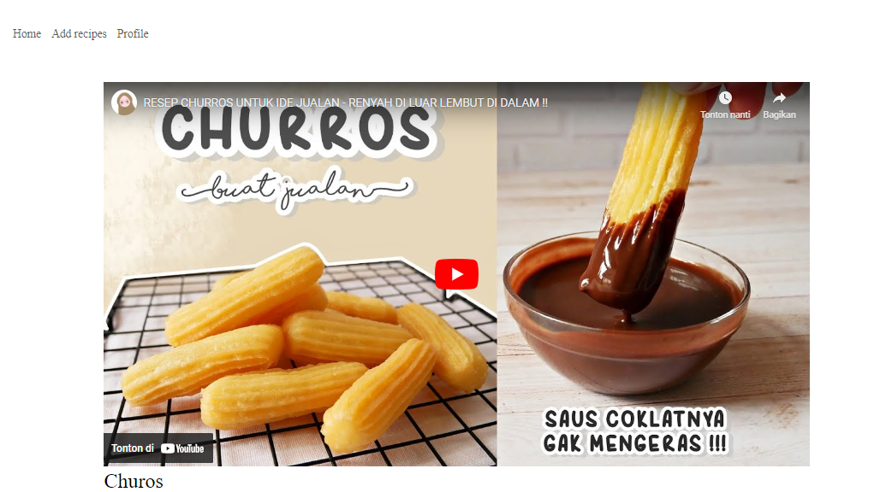
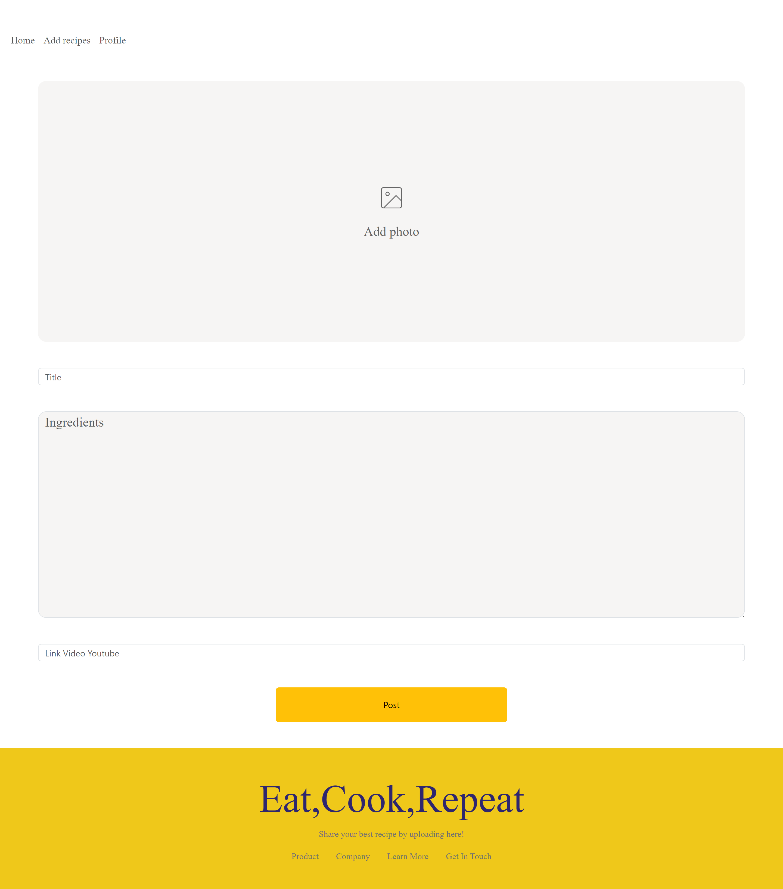
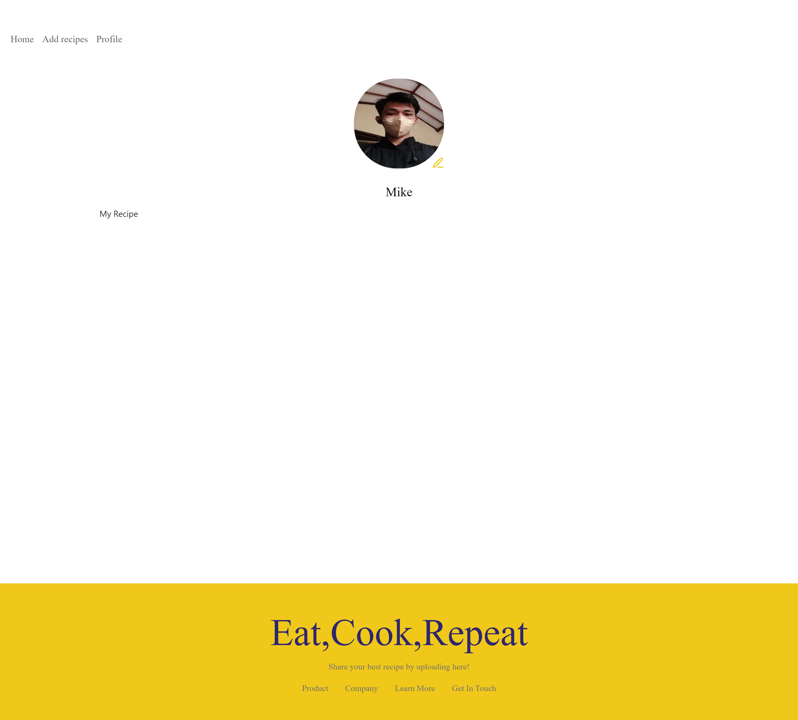

<div align="center">
 
</div>

# Mama recipe Frontend Application

Mamarecipe was created for food lovers or people who are just learning to cook and are also looking for new recipes, where on Mama Recipe's website there are various kinds of food recipes as well as videos from that food.

<br />

## Features

- Users can create a recipe food.
- Users can edit their profile.
- Users can browse available recipe.
- Users accounts can edit and delete recipe.

## Built With

- React JS
- Bootstrap
- Redux Toolkit

## Package dependencies

```bash
	 "axios": "^1.6.5",
    "bootstrap": "^5.3.2",
    "react": "^18.2.0",
    "react-bootstrap": "^2.9.2",
    "react-dom": "^18.2.0",
    "react-icons": "^4.12.0",
    "react-router-dom": "^6.21.1"

  "@types/react": "^18.2.43",
    "@types/react-dom": "^18.2.17",
    "@vitejs/plugin-react": "^4.2.1",
    "eslint": "^8.55.0",
    "eslint-plugin-react": "^7.33.2",
    "eslint-plugin-react-hooks": "^4.6.0",
    "eslint-plugin-react-refresh": "^0.4.5",
    "vite": "^5.0.8"
```

## Environment Variables

```bash
VITE_API_URL=
```

## Installation

Clone the project

```bash
  git clone https://github.com/abdulnaim6/Fe_recipe
```

Go to the project directory

```bash
  cd fe_recipe
```

Install dependencies

```bash
  npm install
```

Start the project

```bash
  npm run dev
```

## Screenshot

<details>
  <summary>
    Login
  </summary>

</details>
<details>
  <summary>
    Register
  </summary>

</details>
<details>
  <summary>
    Home
  </summary>

</details>
<details>
  <summary>
    Search
  </summary>

</details>
<details>
  <summary>
    Detail Recipe
  </summary>

</details>
<details>
  <summary>
    Detail Video
  </summary>

</details>
<details>
  <summary>
    Add Recipe
  </summary>

</details>
<details>
  <summary>
    Profile
  </summary>
<!--  -->
</details>

## Authors

💻 [Abdul Naim](https://github.com/abdulnaim6)

<br />

## Related Project

⚡[`Responsive Web`](https://github.com/abdulnaim6/Responsive_web)⚡

⚡[`Backend Recipe`](https://github.com/abdulnaim6/Be_recipe)⚡

⚡[`Frontend Recipe`](https://github.com/abdulnaim6/Fe_recipe)⚡
